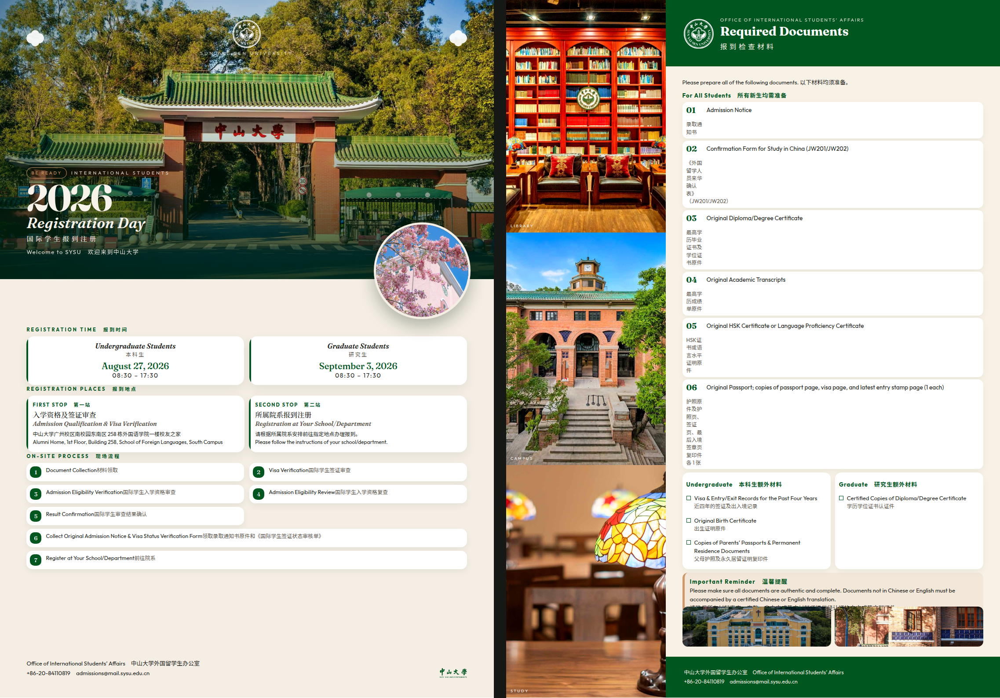

# 中山大学报到海报（两张）

**Want to edit in Canva?** Download the files in [`poster/canva/`](poster/canva/) — Canva cannot open HTML.

要用 **Canva** 打开：请下载 [`poster/canva/`](poster/canva/) 里的 PNG 或 PDF，不要上传 HTML。

## Open in Canva · 用 Canva 打开

| File | Use |
| --- | --- |
| [`poster/canva/poster-1-registration-day.png`](poster/canva/poster-1-registration-day.png) | Poster 1 — upload in **free Canva** as the page background |
| [`poster/canva/poster-2-required-documents.png`](poster/canva/poster-2-required-documents.png) | Poster 2 — same |
| [`poster/canva/poster-1-registration-day.pdf`](poster/canva/poster-1-registration-day.pdf) | Poster 1 — **Canva Pro** File → Import PDF (text often editable) |
| [`poster/canva/poster-2-required-documents.pdf`](poster/canva/poster-2-required-documents.pdf) | Poster 2 — same |
| [`poster/canva/logos/`](poster/canva/logos/) | Official emblem / wordmark SVGs to upload as elements |

Steps (free Canva):

1. Open [canva.com](https://www.canva.com) → **Create a design** → **Custom size** → **297 × 420 mm** (A3).
2. **Uploads** → upload the PNG → drag it to fill the page.
3. Add new text on top if you need to change wording.
4. Repeat for the second poster.

Full steps: [`poster/canva/HOW-TO-CANVA.md`](poster/canva/HOW-TO-CANVA.md)

## Preview without Canva

1. Open **`poster/view.html`** in a browser — both posters, scroll for poster 2.
2. Or open **`poster/index.html`** — click text to edit, then print to PDF.

School green `#00561F` (CMYK 100,0,100,60). Emblem copyright: Sun Yat-sen University.
