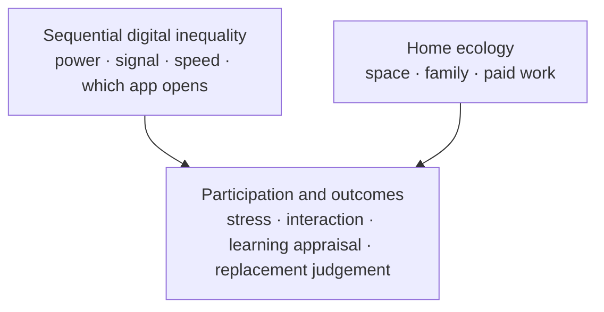

# Figure 1. Material-context model of emergency remote Chinese learning

Redraw this as a single-column journal figure (boxes + arrows). Do not submit mermaid to the journal; it is a sketch.

Investment is **not** in the figure. It is a discussion lens only.

**Caption.** Sequential digital inequality (including platform geography) and home ecology are concurrent conditions. They are read as shaping participation and self-reported outcomes. The figure is a reading model, not a tested path.
