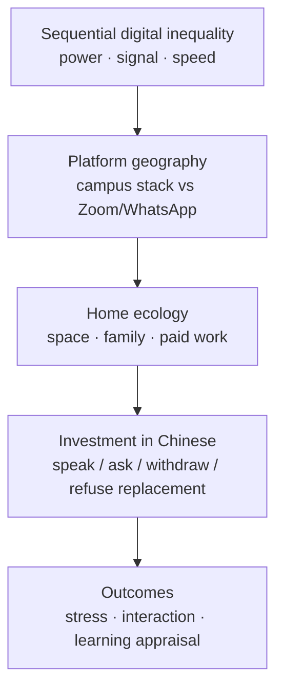

# Figure 1. Material–context model of emergency remote Chinese learning

Redraw this as a single-column journal figure (boxes + arrows). Do not submit mermaid to the journal; it is a sketch.

**Caption (draft).** Emergency remote Chinese is read through sequential digital inequality, **platform geography** (campus stack vs tools that open offshore), and home ecology; these structure investment; outcomes are stress, interaction, and learning appraisal.
