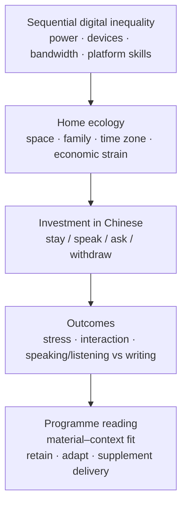

# Figure 1. Material–context model of emergency remote Chinese learning

Redraw this as a single-column journal figure (boxes + arrows). Do not submit mermaid to the journal; it is a sketch.

**Caption (draft).** Conceptual model used in this paper. Emergency remote Chinese classes are read through sequential digital inequality (van Dijk, 2020) and home ecology; these structure Nortonian investment; outcomes are affective, interactional, and skill-specific. The programme implication is fit of *delivery*, not only of textbook content.
