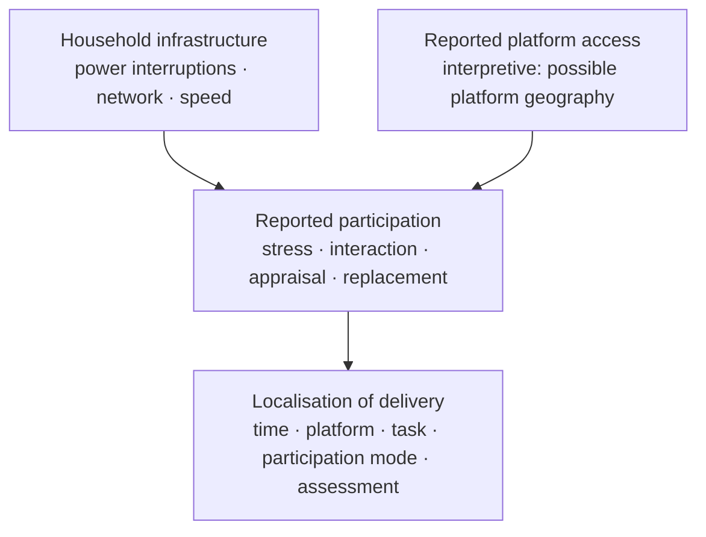

# Figure 1. Localisation of delivery as delivery-context fit

Reading model only. Not a causal path.

```mermaid
flowchart TD
  A[Household infrastructure<br/>power interruptions · network · speed] --> C[Reported participation<br/>stress · interaction · appraisal · replacement]
  B[Reported platform access<br/>interpretive: possible platform geography] --> C
  C --> D[Localisation of delivery<br/>time · platform · task · participation mode · assessment]
```
