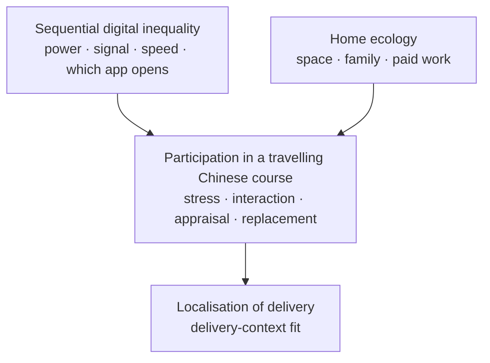

# Figure 1. Localisation of delivery as delivery-context fit

Redraw as a single-column journal figure. Do not submit mermaid to the journal.

Investment is **not** in the figure.

**Caption.** Sequential digital inequality and home ecology are concurrent conditions of a travelling Chinese-university course. They are read as shaping participation. The conceptual contribution is localisation of delivery (delivery-context fit), not a tested path model.
