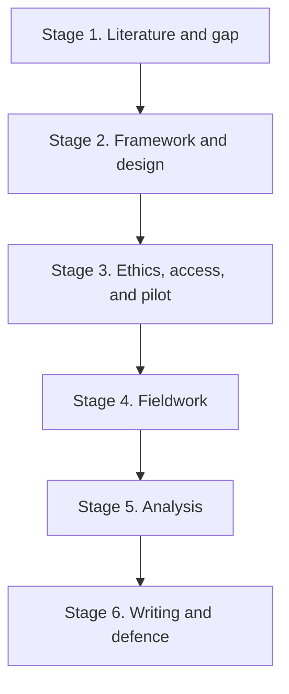
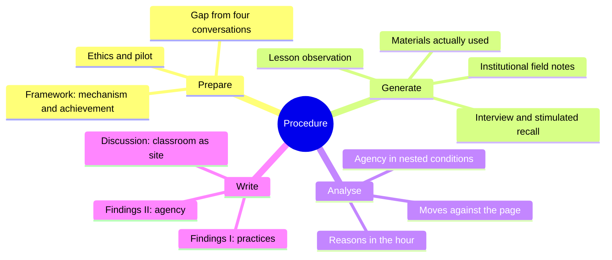

# 3. Research Questions, Procedure and Methodology

**Study.** Recontextualization of Chinese-Language Teaching Materials and Teacher Agency among Pakistani Teachers of Chinese: A Qualitative Study from an Ecological Perspective

This section is for the opening report. Pakistan CFL writing describes programmes and perceived fit. It does not show classroom recontextualization of Chinese-language materials, nor ecological agency, in one design (Lu et al., 2024; Lu & Hanif, 2025; Azeem et al., 2022; Khan et al., 2022). Methods that only interview teachers about localization, or only analyse the HSK book, cannot close that gap (Criado, 2023; Neupane, 2025; Guerrettaz & Johnston, 2013).

---

## (1) Research Questions

The study is organised by one core question, then three research questions. The core question names the two objects in the title. The three questions keep the work question-driven. They cover practices, reasons, and ecological achievement. Agency and nested conditions are asked together in Question 3. On the ecological account, agency is not a trait later placed in context. It is achieved, or not achieved, in conditions (Biesta & Tedder, 2007; Priestley, Biesta, & Robinson, 2015).

**Core question**

How do Pakistani teachers of Chinese recontextualize Chinese-language teaching materials in classroom practice, and how is their agency achieved or constrained within the ecological conditions of their work?

**Research Question 1**

What recontextualization practices do Pakistani teachers of Chinese enact when using Chinese-language teaching materials (addition, omission, substitution, modification, reordering, supplementation, translanguaging, cultural filtering, or faithful transmission)?

This question is necessary because the Pakistan literature has not observed those practices. Naheed (2026) reports which book is used. Azeem et al. (2022) report that teachers are left to add or delete content. Neither study shows what happens to the page in the hour. Faithful transmission is included on purpose. Following the book under examination pressure is still a recontextualizing choice (Rathert & Cabaroğlu, 2021; Song, 2024). It is not coded in advance as a lack of agency.

**Research Question 2**

How do teachers justify these decisions in relation to learners, materials, pedagogy, culture, language resources (Chinese, Urdu, English, and others), assessment, time, and professional identity?

This question is necessary because “why” is not another name for agency. It is practical-evaluative reasoning in the present (Emirbayer & Mische, 1998). Interview-only studies of localization beliefs will overstate what teachers can do (Neupane, 2025; Biesta, Priestley, & Robinson, 2015). Reasons have to be taken from lesson-focused talk and, where permitted, stimulated recall after observed lessons, not from a general attitude to Urdu glosses.

**Research Question 3**

In what ways is teacher agency achieved, restricted, or redirected across the iterational, projective, and practical-evaluative dimensions, and which nested conditions (classroom, collegial and institutional, examination and HSK policy, professional community, and wider sociocultural setting) enable or constrain teacher-mediated localization?

This question is necessary because restricted and addition-only work still count as agency (L. Wang, 2022; Yan & Weng, 2026; Tao & Weng, 2025). HSK is treated here as an institutional condition of teachers’ work, not as a document to be scored for fit (Khan et al., 2022). The question asks how space for manoeuvre is made or blocked, not whether teachers “have” agency.

These three questions do not ask whether a localized Pakistani textbook should be written. They do not evaluate HSK as a product in isolation. They ask where localization is produced or blocked: in everyday teaching.

---

## (2) Research Procedure

The procedure is the order of thesis work, not a list of methods. Each stage has a task, an output, and a limit: a later stage cannot begin until the earlier output exists.

**Stage 1. Literature and gap (Chapters 1–2 of the thesis)**

First, lock the object. The object is teacher-mediated recontextualization of Chinese-language materials in Pakistani classrooms, not materials-fit. Next, write the proposal literature as four conversations: materials recontextualization, ecological agency, localization in international CFL, and Chinese-language education in Pakistani universities. Last in this stage, state the gap that those conversations have not been joined for this population with observation plus materials comparison. Output: opening report; later, the full literature chapter. Limit: CNKI still has to be searched; C. Wang (2022) remains outstanding as a PDF.

**Stage 2. Framework and design (Chapter 3, design part of Chapter 4)**

First, operationalize the two analytic concepts. Recontextualization is the mechanism visible in materials-in-use (Bernstein, 2000; Guerrettaz & Johnston, 2013). Ecological agency is the achievement that makes that mechanism possible, restricted, or redirected (Priestley, Biesta, & Robinson, 2015). Localization is not a third framework. Next, write the case-study protocol: sampling criteria, observation schedule, interview guides, materials log, and a decision-map template (material, move, stated reason, condition). Last, distinguish HSK as a condition from HSK as a research object. Output: analytic framework and protocol. Limit: no coding model is invented in the literature review; it is built here, then revised after the pilot.

**Stage 3. Ethics, access, and pilot**

First, obtain ethics approval and institutional access in Pakistani universities or institutes where Chinese is taught. Next, recruit Pakistani teachers of Chinese by purposive sampling (experience, institution type, materials actually used, HSK orientation). If Chinese national teachers appear in a site, they are a contrastive case, not the title population. Then run a pilot with one or two teachers: one observed lesson, one interview, one materials comparison. Last, revise instruments. Output: consent records, revised protocol. Limit: no claim is made from the pilot as a finding.

**Stage 4. Fieldwork (data for Chapters 5–6)**

Work proceeds teacher by teacher, not questionnaire by questionnaire. For each case, first collect the materials actually used (prescribed pages, slides, worksheets, tests, teacher-made supplements). Next, observe lessons in which those materials are in use. Then hold a lesson-focused interview and, where permitted, a stimulated-recall session on excerpts from the observed lesson. Last, write a field note on institutional conditions (who chooses the book, examination pressure, class size, medium of instruction, collegial time). Output: a case folder per teacher. Limit: questionnaires do not stand in for enacted curriculum. Lu et al. (2024) already collected perception. This stage has to collect practice.

**Stage 5. Analysis**

First, within each case, code recontextualization moves against the page that was available that day (Rathert & Cabaroğlu, 2021, 2022; Hanifa & Yusra, 2023). Next, code reasons as practical-evaluative judgements, not as a single belief about localization. Then code agency across the chordal triad and name the form that was achieved in that ecology, including restricted and addition-only forms (Yan & Weng, 2026; Dao et al., 2025). After within-case work, do cross-case comparison. Last, test whether the gap still holds: if the data show only talk about Urdu support and no classroom conversion, that itself is a finding about restriction, not a failure of the question. Output: case summaries and cross-case matrices. Limit: analogues from China, Vietnam, or Australia are sensitizing ideas. They are not codes to be forced onto Pakistani lessons.

**Stage 6. Writing and defence (Chapters 5–7)**

First, write Findings I as an answer to Question 1: practices, with vignettes, not a university-by-university tour. Next, write Findings II as an answer to Questions 2 and 3: reasons, triad, and nested conditions, using the same teachers. Then write the discussion back to the title: the classroom as the site where localization is produced or blocked. Last, state limits, including no claim of generalizability to all Pakistani teachers of Chinese. Output: thesis draft, then defence. Limit: the conclusion does not become a new textbook.

---

## (3) Research Methodology

The study is an interpretive qualitative multiple-case study of Pakistani teachers of Chinese, nested in their institutions. It is not a survey of localization attitudes. It is not a content analysis of *HSK Standard Course* as the main method. Those two designs are already used in the Pakistan literature, and they cannot see the object named in the title.

### Why a qualitative case design

The object is meaning-making in context: what teachers do with a prescribed page, under examination, time, and language conditions. That object is a case-study object in language education and curriculum research. Priestley, Biesta, and Robinson (2015) built the ecological model from qualitative curriculum cases. Guerrettaz and Johnston (2013) made materials-in-use visible by observing one intact class. Dao et al. (2025) and Yan and Weng (2026) show that prescribed-textbook agency can be studied at classroom level. Bao et al. (2020) show that the ecological lens can be used with teachers of Chinese, though not in Pakistan. The design is therefore acceptable in the discipline. It is borrowed as a method, not as a finding. Those studies supply a warrant that the method exists. They do not supply Pakistani CFL results.

A large-N questionnaire would repeat Lu et al. (2024) and Naheed (2026). It can report perceived misfit and book choice. It cannot report whether a teacher skipped a cultural note, added an Urdu example, or kept the HSK sequence because the test would not wait. Criado (2023) already showed that frequent reported change can leave sequence intact. Neupane (2025) already showed that willingness exceeds practice. Interview-only localization beliefs would treat that discrepancy as the finding.

### Why multiple cases, not one class

One class can show that a book organises interaction (Guerrettaz & Johnston, 2013). This title also asks how agency varies with conditions. Teachers in different universities, with different experience and different examination loads, are likely to achieve different spaces for manoeuvre (L. Wang, 2022; Khan et al., 2022). Multiple cases, each nested in an institution, make that variation visible. Sample size follows case logic and saturation, not a survey formula. About six to eight Pakistani teachers of Chinese is the working target, with two or three observed lessons each, revised after access and the pilot. Depth of observation plus materials comparison matters more than adding cases that cannot be observed.

### Why these data sources, together

| Source | What it can show | Question it serves | Why it is necessary |
|---|---|---|---|
| Comparison of prescribed pages with teacher-made materials, slides, worksheets, and tests | Traces of addition, omission, substitution, reordering | RQ1 | The official layer in the book is not the taught layer (Toledo-Sandoval, 2020; Yasasri, 2024) |
| Lesson observation | Enacted recontextualization, including faithful transmission | RQ1, RQ3 | Practice cannot be inferred from talk (Guerrettaz & Johnston, 2013; Criado, 2023) |
| Semi-structured interviews (biography and lesson-focused) | Iterational resources, projective purposes, stated reasons | RQ2, RQ3 | Agency has a past and a future, not merely a present hour (Emirbayer & Mische, 1998) |
| Stimulated recall after observed lessons, if permitted | Practical-evaluative judgement in that lesson | RQ2, RQ3 | General beliefs are not in-the-moment judgement (Biesta, Priestley, & Robinson, 2015) |
| Field notes on institutional ecology | Meso and exo conditions: book choice, HSK, class size, medium of instruction | RQ3 | Conditions are not background; they are part of the achievement (Priestley et al., 2016; Khan et al., 2022) |

Each source is weak alone. Observation without the page cannot tell what was transformed. The page without observation cannot tell what was taught. Interview without observation repeats the Pakistan perception studies. The three sources together are triangulation of say, do, and artefact. That combination is what the gap named and what the Pakistan CFL papers did not do.

Content analysis of materials is supporting evidence only. It shows what was available to be recontextualized. It is not the finding of the study.

### How the data will be analysed

Analysis has three linked passes, then a cross-case reading.

Pass 1 describes recontextualization moves against the materials of that lesson (addition, omission, substitution, modification, reordering, supplementation, translanguaging, cultural filtering, faithful transmission). The move list is a sensitizing set from Rathert and Cabaroğlu (2021, 2022) and Hanifa and Yusra (2023). It is not a test of whether teachers “localized well.”

Pass 2 reads reasons as practical-evaluative judgements tied to that lesson: learners, time, examination, language resources, identity. A reason that never appears in the observed hour is kept as talk, not recoded as practice.

Pass 3 reads agency as achievement: iterational, projective, and practical-evaluative dimensions, and the nested conditions that opened or closed space for manoeuvre. Forms such as restricted, addition-only, compliant, or persistent are used only if the case supports them (L. Wang, 2022; Yan & Weng, 2026; Chen & Shu, 2026). They are not moral ranks.

Within-case decision maps come first (material, move, reason, condition). Cross-case comparison comes second. The unit of analysis is the teacher-in-institution, not “Pakistan” as one locale.

### Setting, language, ethics, and trustworthiness

The setting is Pakistani universities and institutes where Chinese is taught. Participants are local Pakistani teachers of Chinese. Variation is sought in experience, institution, and materials actually used, including but not limited to HSK-oriented series. Interview and classroom languages (Urdu, English, Chinese) are data. They are not noise. Consent, anonymization of universities and students, and observation ethics are required before Stage 4.

Trustworthiness is built from prolonged engagement, triangulation of say, do, and artefact, member checking of case summaries, and an audit trail. The study does not claim that findings hold for every Pakistani teacher of Chinese. It claims a credible account of the cases, adequate to answer the three questions and to show whether localization is produced in those classrooms or blocked there.

### What this methodology refuses

It refuses a survey of “do you favour localization.” It refuses HSK-fit scoring as the main result. It refuses needs analysis and cognitive-load testing as frameworks. It refuses to treat a new Pakistani textbook as the product of the doctorate. Those refusals follow from the gap. The missing evidence is classroom recontextualization under ecological conditions. The methods are chosen because they can produce that evidence, and because the methods already used in Pakistan CFL research cannot.
